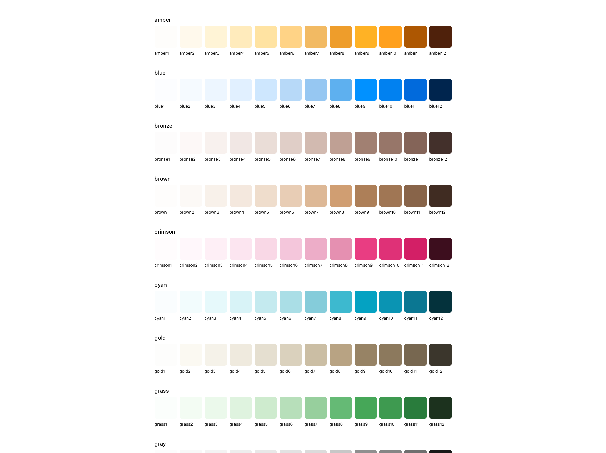

# @radix-ui/colors Viewer

<div align="center">
  
</div> 

## ⚠️ Update: Official documentation

The amazing people at Radix have published [official documention](https://www.radix-ui.com/docs/colors/palette-composition/the-scales) for the project.

## Motivation

The [`@radix-ui/colors`](https://www.npmjs.com/package/@radix-ui/colors) package doesn't include a way of viewing the palettes it offers.

## Running

> 💡 Make sure dependencies are synced by running `npm|yarn install`.

```
npm|yarn start
```

## License

[MIT License](./LICENSE)

---

## Radix

"Components, icons, colors, and templates for building high-quality, accessible UI. Free and open-source."

- [Github](https://github.com/radix-ui)
- [Website](https://www.radix-ui.com/primitives/docs/overview/introduction)
- [Twitter](https://twitter.com/radix_ui)

A project by [Modulz](https://www.modulz.app/).
